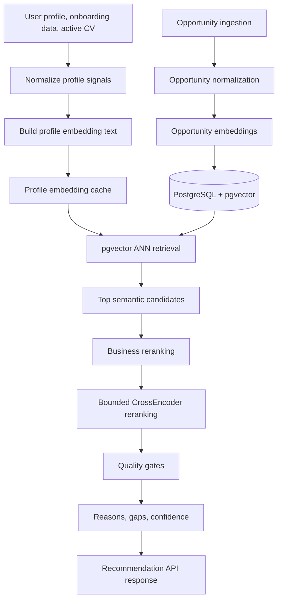
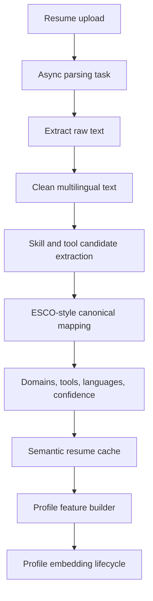
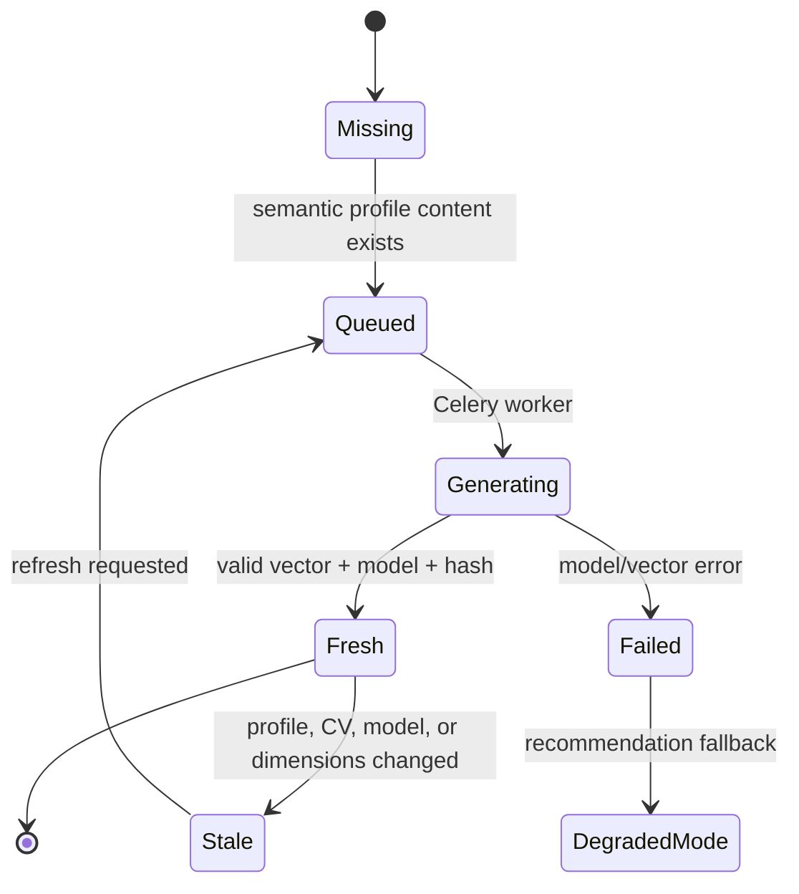
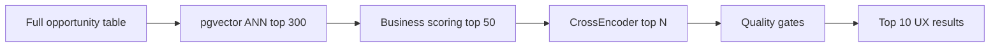
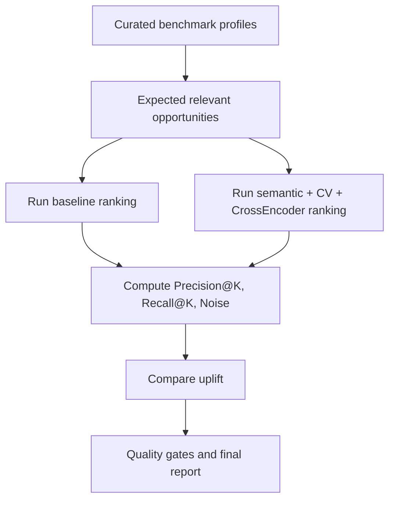
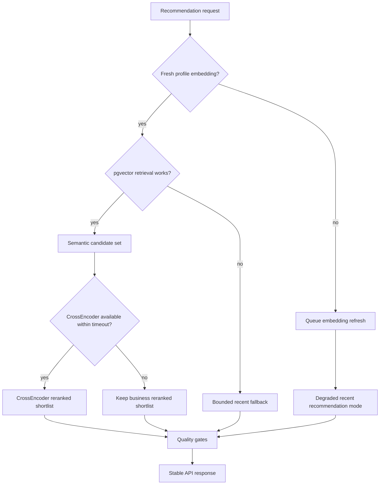

# BidWise AI Recommendation System Architecture

## 1. Introduction & Problem Statement

BidWise is a multilingual job recommendation platform designed for a Tunisian and international job market where job descriptions, user profiles, CVs, and skills may appear in French, English, Arabic, or a mixture of all three.

The recommendation problem is not only about finding jobs that contain the same keywords as a user's profile. A candidate may write `Django REST APIs` in a CV, while an opportunity may mention `backend web services`, `PostgreSQL`, or `API development`. A useful recommendation engine must understand semantic proximity, not only exact word overlap.

The current BidWise recommendation system is built as a practical production-oriented AI pipeline:

- multilingual semantic embeddings;
- profile embeddings;
- opportunity embeddings;
- PostgreSQL + pgvector vector search;
- ANN retrieval with ivfflat;
- hybrid retrieval-then-rerank architecture;
- optional bounded local CrossEncoder reranking for top candidates;
- deterministic explainable recommendation reasons and gaps;
- asynchronous profile embedding lifecycle management;
- CV-aware semantic matching.

This document describes the real implemented architecture. It does not claim model fine-tuning, LLM-based reasoning, or deep learning training that has not been implemented.

## 1.1 Soutenance Snapshot - Validated Current State

For the PFE defense, the BidWise recommendation engine should be presented as a
hybrid AI and taxonomy-based system, not as a supervised model trained from a
large private dataset.

Current validated decision:

- **Main AI model used:** `sentence-transformers/paraphrase-multilingual-MiniLM-L12-v2`.
- **Model role:** generate multilingual embeddings for opportunities, profiles,
  and CV-derived semantic text.
- **Vector infrastructure:** PostgreSQL + pgvector for bounded candidate
  retrieval.
- **Taxonomy backbone:** ESCO skills and occupations, used for skill
  normalization, aliases, and explainable evidence.
- **Local market adaptation:** `BidWiseSkillAlias`, used for real vocabulary not
  reliably covered by ESCO, such as `ReactJS`, `Node JS`, `Excel`, `Sage`,
  `Django`, `FastAPI`, `Flask`, and similar terms.
- **Optional reranker:** CrossEncoder support exists, but it is disabled by
  default unless the model is explicitly available locally. This avoids runtime
  downloads and unstable latency before deadline.
- **Optional LLM enrichment:** Gemini can be enabled for offline/asynchronous
  structured extraction from CVs and scraped opportunities. It is not used as
  the live ranking engine.
- **No claim:** BidWise does not currently train a supervised recommendation
  model on user-click/application history because the project does not yet have
  enough historical labeled interaction data.

The practical value is the combination:

```text
pretrained multilingual embeddings
+ pgvector retrieval
+ deterministic business scoring
+ ESCO normalization
+ BidWise aliases
+ optional Gemini structured enrichment
+ CV/profile/opportunity evidence
+ explainable frontend reasons
```

This architecture is appropriate for a limited-data project because it reuses
strong pretrained language models while adding domain-specific structure through
ESCO and controlled BidWise aliases.

### Production Stabilization Notes

Phase 1 stabilization keeps the architecture frozen and makes the existing
behavior explicit:

- pgvector retrieval is controlled by `OPPORTUNITY_PGVECTOR_ENABLED`;
- CrossEncoder is disabled by default for stability unless explicitly enabled;
- generated benchmark reports and duplicated local artifacts are ignored by Git;
- unused duplicate modules such as `ai/app.py` and legacy `ai/esco.py` are
  removed to avoid confusion with the real Django app config and models.

### Repository Layout Cleanup - Single AI Source Of Truth

Before adding any LLM provider, the AI package layout was cleaned to avoid
architecture ambiguity.

The single active Django AI application is:

```text
backend/ai/
```

It contains the recommendation engine, embeddings, pgvector retrieval, ESCO
normalization, aliases, quality gates, explainability, management commands,
tests support, and AI data files.

The accidental local duplicate path `backend/backend/` was removed from the
workspace. It contained generated benchmark artifacts and an older copy of
`bidwise_skill_alias_review.csv`, was not imported by Python code, and was
already ignored by Git through `.gitignore`.

Current data ownership:

```text
backend/ai/data/esco/raw/        official ESCO CSV files
backend/ai/data/                 BidWise alias seed/review files
backend/ai/management/commands/  ESCO, alias, benchmark and backfill commands
```

This cleanup makes the LLM phase safer: Gemini integration belongs inside
`backend/ai/`, not in a second parallel AI package.

### Phase 4 - Gemini LLM Enrichment Foundation

Gemini is introduced as an optional enrichment layer, not as a replacement for
the deterministic recommendation engine.

Current implementation:

```text
backend/ai/llm/
  providers.py    Gemini/Ollama providers, retry/fallback chain, disabled fallback
  schemas.py      controlled JSON schema and output validation
  enrichment.py   CV and opportunity extraction prompts

backend/ai/management/commands/benchmark_gemini_enrichment.py
backend/ai/management/commands/enrich_opportunities_with_gemini.py
```

Runtime principle:

```text
CV or opportunity text
-> Gemini structured JSON extraction
-> strict backend validation
-> ESCO normalization / aliases / families
-> stored signals
-> existing pgvector + scoring + quality gates
```

Security and performance rules:

- API keys are read only from environment variables, never committed to source.
- Gemini is disabled by default through `LLM_ENRICHMENT_ENABLED=false`.
- Gemini is intended for benchmark, backfill, or asynchronous enrichment jobs.
- Gemini must not be called inside the live `For You` ranking request.
- JSON output is validated and constrained before being trusted.

Configuration:

```text
LLM_ENRICHMENT_ENABLED=true
LLM_PROVIDER=gemini
GEMINI_API_KEY=<secret>
GEMINI_MODEL=gemini-2.5-flash-lite
GEMINI_FALLBACK_MODELS=gemini-2.0-flash-lite
GEMINI_TIMEOUT_SECONDS=20
GEMINI_TEMPERATURE=0.1
GEMINI_MAX_OUTPUT_TOKENS=4000
LLM_PROVIDER_MAX_RETRIES=1
LLM_PROVIDER_RETRY_DELAY_SECONDS=8
LLM_PROVIDER_RETRY_BACKOFF_FACTOR=2

# Optional local fallback. Enable only after installing Ollama and pulling the model.
OLLAMA_FALLBACK_ENABLED=false
OLLAMA_BASE_URL=http://host.docker.internal:11434
OLLAMA_MODEL=qwen2.5:7b-instruct
OLLAMA_TIMEOUT_SECONDS=45
```

Benchmark command:

```bash
python manage.py benchmark_gemini_enrichment --target resumes --limit 5
python manage.py benchmark_gemini_enrichment --target opportunities --limit 5
```

The benchmark command waits between LLM calls by default to respect free-tier
rate limits. On a free Gemini key, `HTTP 429 RESOURCE_EXHAUSTED` means the API
quota has been reached; it is not a recommendation-engine failure.

Provider resilience:

```text
Gemini primary model
-> retry transient errors such as 429, 500, 502, 503, 504
-> Gemini fallback models from GEMINI_FALLBACK_MODELS
-> optional local Ollama fallback when OLLAMA_FALLBACK_ENABLED=true
-> clean failure/skip for the current row without blocking live users
```

This makes the enrichment pipeline suitable for real scraped datasets where
cloud LLMs may occasionally return `503 high demand`. Paid Gemini tiers can
improve quota limits, but the production-safe pattern is still asynchronous
batch enrichment with retry, fallback and stored results.

Ollama local fallback:

```bash
ollama pull qwen2.5:7b-instruct
ollama serve
```

From Docker, BidWise reaches the local Ollama server through
`http://host.docker.internal:11434`. If the local model is unavailable, the
batch records a clean provider failure instead of corrupting opportunity data.

Initial validation on real BidWise data:

```text
Resume backend sample:
roles: Backend Engineer
family: backend
skills: Python, Django, FastAPI, REST APIs, SaaS, Authentication
tools: PostgreSQL, Redis, Celery

Resume fullstack sample:
roles: Full Stack Developer, Web Developer, Scrum Master
family: fullstack
skills: Javascript, Python, PHP, Django, NodeJS, AngularJS, CI/CD
tools: jQuery, Drupal, MongoDB, MySQL, WordPress, Jenkins, GitLab

Opportunity ERP sample:
roles: ERP Consultant, ERP Project Manager
family: it_support_network
skills: ERP Implementation, System Integration, Project Management

Opportunity CNC sample:
roles: Technicien Usinage CNC
family: quality_industry
skills/tools: Usinage CNC, CNC

Opportunity commercial sample:
roles: Assistant(e) Commercial(e)
family: sales
```

Expected value:

- CVs: extract cleaner skills, roles, seniority, domains and languages.
- Opportunities: enrich scraped jobs with missing/generic skills.
- Families métier: classify rows into controlled families such as `backend`,
  `frontend`, `accounting_finance`, `marketing`, `hr`, or `quality_industry`.
- Explainability: provide better structured evidence for frontend reasons.

Gemini strengthens the AI story for the PFE because it adds language
understanding where the previous pipeline relied too much on lexical extraction
and conservative static filters. The final ranking remains controlled,
testable, and explainable.

#### Controlled Opportunity Enrichment

After the initial benchmark, Gemini is allowed to enrich weak opportunity rows
under strict rules:

- only opportunities with empty skills or very generic skills are eligible by
  default;
- strong existing skill lists such as `Python, Django` are not overwritten;
- Gemini output is stored under `opportunity.extra_data["llm_enrichment"]`;
- extracted skills are applied only when confidence is high enough
  (`0.75` by default);
- applied skills are immediately normalized through the existing ESCO storage
  pipeline;
- the command is rate-limit aware and defaults to a delay between calls.

Command:

```bash
python manage.py enrich_opportunities_with_gemini --source Keejob --limit 5
python manage.py enrich_opportunities_with_gemini --source Keejob --limit 5 --audit --json
python manage.py enrich_opportunities_with_gemini --source Keejob --limit 5 --no-apply-skills
```

This improves frontend-visible recommendation quality because scraped
opportunities with missing structured skills can receive useful structured
signals before pgvector/scoring/explainability consume them.

#### Phase 4B - LLM Business Families In Ranking

Gemini business families are now consumed by the recommendation engine as a
lightweight métier signal.

Controlled family examples:

```text
backend, frontend, fullstack, data_ai, accounting_finance, marketing, sales,
hr, design, it_support_network, quality_industry, administration
```

Scoring behavior:

- if the user profile family and opportunity LLM family are compatible, BidWise
  applies a small business-family bonus;
- if they are clearly incompatible, BidWise applies a small final penalty;
- compatible families such as `frontend` + `fullstack` or `backend` +
  `fullstack` are treated as related, not contradictory;
- the signal is visible in recommendation debug and evidence summary;
- explainability can show `Related job family signal detected`.

This does not replace embeddings, ESCO, skills, role match, or quality gates.
It solves a practical weakness observed in the frontend: jobs with no structured
skills can still carry useful métier evidence after Gemini enrichment.

Frontend validation also showed that strict substring role matching was too
rigid: `Frontend Developer` did not count as aligned with `Frontend React
Developer`. Role matching now accepts token-level title alignment, so inserted
technology words do not hide an otherwise correct role. Offers that combine a
matched target role and profile skills receive a small density boost, helping a
true frontend React job outrank a backend-heavy fullstack JavaScript job when
the user explicitly targets frontend work.

### Phase 5A - Frontend Explainability UX

The recommendation UI now presents evidence in a more decision-oriented format:

- dynamic match summary instead of a generic explanation sentence;
- prioritized reasons: role, skills, job family, semantic/CV, then preferences;
- signal chips such as `Role`, `Skills`, `Family`, `CV`, `Work mode`, and
  `Location`;
- recommendation gaps are grouped under `Review before applying`;
- Gemini family evidence is shown as `Same job family as your profile`;
- filtered For You copy is more honest: `Recommended matches found in this
  page`.

The frontend still consumes deterministic backend evidence. It does not ask an
LLM to generate user-facing explanations at request time.

### Phase 5B.1 - Detail Page Fit Explanation

The opportunity detail page now reuses the same deterministic recommendation
evidence with a detail-specific presentation:

- the insight panel title becomes `Your fit`;
- the summary is more action-oriented, for example `Recommended to apply` or
  `Good fit, but review the details`;
- the detail page can show slightly more reasons and skill gaps than compact
  feed cards;
- a compact decision verdict is shown on detail pages: `Recommended to apply`,
  `Good fit`, or `Worth reviewing`;
- the implementation reuses `RecommendationInsightPanel` and
  `buildRecommendationViewModel`, avoiding duplicated explanation logic.

This gives users a consistent path from the For You card to the detail page:
the card helps them decide whether to click, and the detail page helps them
decide whether to apply or adjust their profile.

### Phase 6 - Product Validation Matrix

Before freezing recommendation work, BidWise uses a dedicated validation matrix:

```text
backend/docs/AI_RECOMMENDATION_VALIDATION_MATRIX.md
```

The matrix covers complete profiles, partial profiles, CV-rich profiles,
missing CVs, noisy CVs, contract/work-mode/location preferences, Gemini-enriched
opportunities, generic skills, and multiple business domains. Its goal is to
validate the full recommendation product behavior before moving to unrelated
features.

Validation refinements already applied:

- generic contextual skills such as `Support` are not treated as universal
  evidence. A network profile can match `Technical Support Specialist`, but it
  should not match `Junior HR Support Specialist` only because both contain the
  word `Support`. Short tokens such as `IT` and `IP` are matched as exact
  tokens to avoid accidental matches inside unrelated words;
- frontend gaps are labeled `Review before applying` because the same section
  can contain skill gaps, contract mismatch, location mismatch, or work-mode
  mismatch.

### Phase 2 - Profile ESCO Normalization Fix

Profile skill normalization is now part of the profile update lifecycle. When a
candidate updates `competences`, BidWise:

1. stores the cleaned list in `Profil.raw_skills`;
2. clears stale `Profil.normalized_skills`;
3. clears the previous normalization hash, timestamp, and error;
4. enqueues `enqueue_profile_skill_normalization` after the database commit;
5. keeps the existing profile embedding invalidation and refresh lifecycle.

This prevents a stale profile problem where the visible skills changed but the
ESCO-normalized evidence used by the recommendation engine still represented
older data.

The ranking path consumes normalized skills in three places:

- `build_user_features()` reads `profile.normalized_skills`;
- `build_user_features()` also merges active CV
  `resume.extracted_normalized_skills`;
- `rank_opportunities()` compares those user-side normalized skills against
  `opportunity.normalized_skills` through `build_esco_skill_overlap()`.

Backfill result after the fix:

```text
profiles eligible for normalization: 11
payload coverage before backfill: 27.27%
official ESCO match coverage before backfill: 9.09%

payload coverage after backfill: 100.00%
official ESCO match coverage after backfill: 81.82%
pending profiles after backfill: 0
failed profiles after backfill: 0
```

Remaining unmatched profile terms such as `React`, `Django`, `Node.js`,
`REST API`, `Content Marketing`, `Google Analytics`, `Tax`, and `Payroll` are
not treated as a failure of the architecture. They are useful inputs for the
next controlled improvement layer: validated BidWise aliases and lightweight
business skill families.

### Mini-Phase - Target Role Autocomplete Stabilization

`Profil.target_roles` is intentionally kept as a user-facing list of desired job
titles. It is supported by the existing `ProfileSuggestion` index, which is
rebuilt from active opportunity titles, skills, and industry metadata.

Current role suggestion flow:

```text
active opportunities
-> extract title-derived role candidates
-> canonicalize role variants
-> aggregate by opportunity frequency
-> store ProfileSuggestion rows
-> serve /profile/roles/suggest/
-> onboarding and profile edit autocomplete
```

The index was rebuilt from the current opportunity database:

```text
opportunities scanned: 3122
profile terms extracted: 2619
suggestions kept: 519
roles kept: 256
skills kept: 254
interests kept: 9
```

Role autocomplete is used in both onboarding and profile editing. This improves
recommendation quality because users are guided toward titles that resemble real
opportunities already present in BidWise.

The stabilization also tightened role matching: raw opportunity titles remain
available as display aliases, but role search tokens are now derived from the
canonical role and controlled role aliases. This prevents contextual words from
titles, such as `Agence Marketing`, from making unrelated roles appear for a
`marketing` role query.

Example validated queries:

```text
backend   -> Python Backend Developer
front     -> Frontend Developer
data      -> Data Scientist, Data Engineer, ...
comptable -> Comptable, Aide Comptable, Assistant Comptable, ...
rh        -> Responsable Rh
marketing -> no false role suggestion
```

### CV NER Model Benchmark Decision

Before replacing the current CV semantic extraction pipeline, two pretrained
resume/CV NER models were tested as isolated read-only experiments:

- `yashpwr/resume-ner-bert-v2`;
- `AventIQ-AI/Resume-Parsing-NER-AI-Model`.

Both models expose resume-oriented labels such as `Skills` or `SKILL`, so they
are theoretically relevant. In practice, on a small BidWise CV sample, they were
not reliable enough to replace the current pipeline.

Benchmark sample:

```text
CVs tested: 3
max text per CV: 1800 chars
current pipeline unique candidates: 68
current pipeline known useful skill hits: 11
current pipeline obvious noise/long phrase hits: 6

yashpwr/resume-ner-bert-v2 unique skill entities: 7
yashpwr known useful skill hits: 1
yashpwr long phrase skill hits: 2

AventIQ unique skill entities: 0
AventIQ known useful skill hits: 0
```

Observed issues:

- `AventIQ-AI/Resume-Parsing-NER-AI-Model` misclassified technical terms such
  as `Python`, `Django`, `FastAPI`, and `PostgreSQL` mostly as `EDUCATION` or
  `EMAIL`, not `SKILL`.
- `yashpwr/resume-ner-bert-v2` sometimes detected a `Skills` group, but missed
  many obvious skills and occasionally returned long fragments as skills.
- The current BidWise pipeline is noisy, but it still captures more useful
  recommendation candidates on the tested data.

Decision:

```text
Do not integrate a pretrained CV NER model into production before deadline.
Continue Phase 3 by improving BidWise candidate quality filters.
Keep CV NER models as future benchmark candidates, not runtime dependencies.
```

This is a pragmatic choice: a specialized model could become useful later, but
it must outperform the current extraction on real BidWise FR/EN CVs before it
becomes part of the production recommendation path.

### Phase 3 - CV Candidate Quality Cleanup

The CV pipeline is intentionally focused on recommendation signals, not on full
CV parsing. BidWise does not need to extract every detail from a resume before
deadline. It needs reliable signals that improve matching:

- skills and tools;
- domains and role evidence;
- languages;
- experience hints already represented in profile fields when available.

The main Phase 3 problem was noisy raw CV candidates being sent to ESCO
normalization. Examples included verbs, sentence fragments, and vague terms such
as `être`, `Proposer`, `équipe`, `creating`, `robust and scalable systems`, and
`à la pression`.

The cleanup added conservative filtering rules:

- keep safe known skills and aliases first;
- reject isolated action verbs such as `proposer`, `assister`, `creating`,
  `maintenir`, and similar terms;
- reject vague business/noise terms such as `équipe`, `force`, `pression`;
- reject long non-skill phrases such as `robust and scalable systems` and
  `reusable components`;
- preserve market skills such as `Python`, `Django`, `React`, `Excel`, and
  `Sage`.

Backfill result after applying candidate cleanup to existing CVs:

```text
CVs eligible: 23
failed CV cleanup runs: 0
payload coverage: 95.65%
official ESCO match coverage: 95.65%
official matches preserved: 43

unmatched CV entries before cleanup: 380
unmatched CV entries after cleanup: 122
noise reduction: about 68%
pending CV entities after cleanup: 0
```

Remaining unmatched terms such as `js`, `aws`, `ci/cd`, `django`, and `docker`
are not treated as garbage. They are useful inputs for the next layer:
validated BidWise aliases and business skill families.

### Final Calibration - Evidence Density

Manual product validation showed that the ranking improved after profile/CV
cleanup, but some weak matches could still appear too high:

- role-only matches with no structured skills;
- isolated skill matches such as only `Excel`, `Python`, or `JavaScript`;
- recommendations with high location/work-mode alignment but limited métier
  evidence.

The final calibration keeps the same architecture but makes confidence and
ranking more honest:

```text
role + matching profile skills
> role-only match
> isolated skill-only match
> preference-only match
```

Implemented rules:

- recommendations now distinguish profile-entered skill overlap from CV-derived
  skill overlap;
- when the user has explicit `competences` or `target_roles`, an old CV signal
  alone cannot carry an unrelated métier recommendation;
- role-only matches without structured skills are still allowed, but their score
  and confidence are calibrated down;
- isolated skill-only matches are penalized for explicit profiles unless
  semantic similarity is very strong;
- role-aligned titles receive a small controlled boost, helping exact target
  roles such as `Python Backend Developer` outrank broader alternatives such as
  `Full Stack Developer` when scores are close.

This calibration is not a refactor. It is a quality layer that makes visible
recommendations closer to user expectations while preserving semantic retrieval,
ESCO normalization, CV evidence, and existing quality gates.

### Why ESCO Is Kept

ESCO remains useful because it provides an official multilingual skill and
occupation taxonomy. It improves normalization for canonical skills such as
`accounting`, `communication`, `JavaScript`, `Python`, `English`, and many
business skills.

ESCO is not enough by itself. Real scraped opportunities contain abbreviations,
framework names, local terms, and noisy labels. This is why BidWise keeps a
custom alias layer and plans a lightweight business-family layer before testing
additional datasets such as ROME 4.0.

### Expected Questions And Answers

**Did you train your own ML model?**

No. The system uses a pretrained multilingual sentence-transformer model for
embeddings. This is the correct choice at the current data maturity level
because BidWise does not yet have enough labeled user interaction history to
train a reliable supervised recommender.

**Where is the dataset?**

There are three categories of data:

- scraped opportunities stored in PostgreSQL;
- user profiles and CV semantic extraction results stored in PostgreSQL;
- ESCO raw CSV/catalog data used as an external taxonomy for normalization.

The recommendation dataset is therefore not only a CSV file. It is mostly the
live application database plus the ESCO taxonomy.

**Where is the AI?**

The AI part is the embedding model and semantic retrieval. The taxonomy part is
ESCO normalization. The business intelligence part is deterministic scoring,
aliases, quality gates, and explainability.

**Why not only ESCO?**

ESCO is structured and official, but it does not cover every market term,
framework, abbreviation, or local expression. ESCO gives academic and semantic
structure; BidWise aliases adapt the system to real job-market vocabulary.

**Why not train a prediction model now?**

A supervised model would require enough historical labels such as impressions,
clicks, saves, applications, interviews, and accepted recommendations. Without
that data, a trained model would likely overfit and be less reliable than a
hybrid pretrained-embedding approach.

## 2. Why Traditional Job Matching Is Limited

Traditional job matching usually relies on exact keywords or filters:

- same skill name;
- same job title;
- same location;
- same contract type;
- same experience level.

This is useful, but limited.

Example:

```text
Profile:
Python, Django, REST APIs, PostgreSQL

Opportunity:
Backend developer building scalable API services with relational databases
```

A keyword-only system may miss the match if the exact terms do not overlap enough. It also struggles with multilingual data:

```text
French: développeur backend
English: backend developer
Arabic: مهندس برمجيات خلفية
```

BidWise uses embeddings to represent profile and opportunity content as dense numerical vectors. This allows the system to compare meaning rather than only literal tokens.

## 3. BidWise AI Recommendation Vision

The goal of the BidWise recommendation system is to combine two complementary approaches:

1. **Semantic AI matching**
   Understand whether a user's profile is semantically close to an opportunity, even when the wording differs.

2. **Business-aware matching**
   Preserve practical job-search constraints such as skills, location, work mode, employment type, industry, and experience level.

This is why BidWise uses a hybrid recommendation design:

```text
semantic retrieval
→ business reranking
→ explainable recommendation output
```

Semantic search provides broad understanding. Business reranking keeps the result useful and realistic.

## 4. Global AI Architecture

High-level architecture:

```text
Opportunity ingestion
    ↓
Opportunity normalization
    ↓
Opportunity embedding generation
    ↓
PostgreSQL pgvector storage

User profile / onboarding / CV
    ↓
Profile normalization
    ↓
Profile embedding generation
    ↓
Embedding metadata + stale detection

Recommendation request
    ↓
pgvector ANN semantic retrieval
    ↓
Existing business reranking
    |
Bounded CrossEncoder semantic reranking
    |
Quality gates
    ↓
Explainable reasons and gaps
    ↓
Recommendation API response
```

Core technologies:

- **Django + DRF** for backend APIs;
- **PostgreSQL** for relational data;
- **pgvector** for vector similarity search;
- **Celery + Redis** for asynchronous embedding generation;
- **sentence-transformers/paraphrase-multilingual-MiniLM-L12-v2** for multilingual embeddings;
- **cross-encoder/ms-marco-MiniLM-L-6-v2** for optional local top-candidate reranking;
- **384-dimensional vectors** for both profile and opportunity embeddings.

### 4.1 Visual AI System Diagrams

These diagrams summarize the implemented production architecture in a jury-friendly form.

#### Recommendation Pipeline



#### CV Semantic Parsing Pipeline



#### Embedding Lifecycle



#### Retrieval Then Rerank



#### Benchmark Flow



## 5. Opportunity Embeddings Pipeline

Opportunities are transformed into semantic vectors using the multilingual embedding model:

```text
sentence-transformers/paraphrase-multilingual-MiniLM-L12-v2
```

The current embedding identifier is versioned using:

```text
sentence-transformers/paraphrase-multilingual-MiniLM-L12-v2@prod-v1-fr
```

Opportunity embeddings are stored in two forms:

- `embedding_vector`: JSON representation used by Python scoring logic;
- `embedding_vector_pg`: pgvector `VectorField(dimensions=384)` used by PostgreSQL vector search.

This dual storage gives the system both:

- efficient database retrieval via pgvector;
- compatibility with existing Python scoring and testing utilities.

Embedding generation is handled by the existing opportunity embedding service and management commands. The system validates vector dimensions before storing pgvector payloads.

## 6. Profile Embeddings Pipeline

User profiles are also converted into semantic embeddings. The profile embedding text is built from structured user signals such as:

- skills;
- target roles;
- industries/interests;
- experience level and years;
- preferred locations;
- work modes;
- employment types;
- salary preference;
- active CV parsed text.

Example structured embedding text:

```text
skills: Python, Django
target roles: Backend Developer
industries: Healthcare
experience level: JUNIOR
location: Tunis
work modes: REMOTE
employment types: FULL_TIME
resume: Backend Django APIs PostgreSQL Celery Redis
```

This structure keeps embedding input deterministic and auditable. It also prevents the profile embedding from becoming an uncontrolled concatenation of arbitrary text.

## 7. Semantic CV Understanding

BidWise does more than append raw CV text to the profile. The resume pipeline extracts structured semantic signals and uses them as first-class recommendation features.

Implemented CV semantic signals include:

- extracted skills;
- extracted tools and platforms;
- inferred professional domains;
- detected languages;
- semantic confidence score;
- semantic resume status;
- semantic resume version;
- content hash for cache invalidation;
- active CV selection.

The pipeline is deterministic and production-safe:

```text
active resume
-> parsed text
-> multilingual text cleanup
-> candidate skill/tool/domain extraction
-> normalization
-> ESCO-style canonical mapping
-> semantic confidence scoring
-> cached semantic resume fields
-> profile feature builder
-> profile embedding refresh
```

The canonicalization step is important because candidates rarely write skills in exactly the same form as job descriptions. For example:

```text
CV terms:
JS, JavaScript, React.js, PostgreSQL, Postgres, REST API

Canonical semantic signals:
javascript, react, postgresql, rest api
```

These extracted signals are merged with explicit profile fields without overwriting user-entered preferences. This lets the recommendation engine benefit from CV evidence while keeping onboarding data auditable.

The CV semantic layer improves recommendations in three ways:

- it enriches sparse profiles when a user has not filled every onboarding field;
- it captures practical experience mentioned in the resume but missing from explicit skills;
- it improves multilingual matching by normalizing semantically similar resume terms.

If semantic CV processing fails or produces no reliable signal, the system keeps the parsed text fallback and continues recommendation generation in degraded mode. No LLM parsing or external API call is required in the recommendation request path.

## 8. Vector Embeddings & Semantic Matching

An embedding is a numerical representation of text. Instead of comparing words directly, the system compares vectors.

Example:

```text
"Backend Django APIs"
→ [0.12, -0.03, 0.44, ...] 384 dimensions

"Develop REST services with Python"
→ [0.10, -0.04, 0.41, ...] 384 dimensions
```

If two vectors point in a similar direction, the system considers the texts semantically close.

BidWise uses cosine similarity:

```text
cosine similarity close to 1.0 → strong semantic match
cosine similarity close to 0.0 → weak semantic match
```

This is what makes the system real semantic AI matching rather than only keyword search.

## Why This Is Real AI

BidWise is not only a hardcoded scoring system. It uses learned NLP models and vector-space semantic representations to understand meaning beyond exact keywords.

The AI components are:

- **Transformer embeddings**
  Profiles, CV signals, and opportunities are converted into dense vectors using a multilingual sentence-transformer model.

- **Vector similarity**
  The system compares semantic meaning through cosine similarity between 384-dimensional vectors.

- **Semantic retrieval**
  pgvector retrieves opportunities close to the user's semantic profile, even when vocabulary differs.

- **Pairwise semantic reranking**
  A CrossEncoder scores profile-opportunity pairs directly for the strongest candidates.

- **Multilingual representations**
  French, English, Arabic, and mixed-language job-market text can be compared in the same embedding space.

- **ANN vector search**
  Approximate nearest neighbor retrieval makes semantic search scalable inside PostgreSQL.

This is different from traditional keyword matching:

| Traditional matching | BidWise AI matching |
|---|---|
| Checks whether the same words appear. | Compares semantic proximity between profile and opportunity text. |
| Depends heavily on exact labels. | Handles synonyms, related skills, and multilingual wording. |
| Uses SQL filters and hand-written scores only. | Uses learned embeddings plus business-aware reranking. |
| Often misses implicit CV evidence. | Extracts semantic CV signals and uses them in ranking. |
| Cannot deeply compare two texts. | CrossEncoder reranking compares profile-opportunity pairs. |

The system still includes deterministic business rules, but those rules sit on top of real semantic retrieval rather than replacing it.

## 9. Multilingual Embeddings

Tunisia's job market often mixes French, Arabic, and English:

- job titles may be in French;
- technical skills may be in English;
- profile or CV text may contain Arabic;
- companies may use bilingual descriptions.

The selected model, `paraphrase-multilingual-MiniLM-L12-v2`, supports multilingual sentence embeddings. This allows BidWise to compare meaning across language boundaries better than rule-based keyword matching.

Example:

```text
Développeur backend
Backend Developer
مهندس برمجيات خلفية
```

These phrases can be closer in vector space than unrelated job terms, even if they do not share the same surface tokens.

## 10. pgvector ANN Retrieval

BidWise stores opportunity embeddings in PostgreSQL using pgvector.

The system uses cosine distance search:

```sql
ORDER BY embedding_vector_pg <=> profile_embedding
```

This allows PostgreSQL to retrieve the nearest opportunity vectors for a user profile.

The existing ANN index is:

```text
opp_embedding_pg_ivfflat_idx
USING ivfflat (embedding_vector_pg vector_cosine_ops)
WHERE embedding_vector_pg IS NOT NULL
```

The recommendation retrieval configures pgvector session settings locally:

```sql
SET LOCAL ivfflat.iterative_scan = relaxed_order;
SET LOCAL ivfflat.probes = 2;
SET LOCAL ivfflat.max_probes = 20;
```

This improves recall under filters such as:

- active opportunities only;
- job opportunities only;
- compatible embedding model;
- non-null vector embeddings.

The purpose is to avoid loading thousands of opportunities into Python before semantic ranking.

## 11. Retrieval-Then-Rerank Pipeline

BidWise follows a retrieval-then-rerank architecture:

```text
Step 1: ANN semantic retrieval
    Retrieve top semantic candidates from PostgreSQL using pgvector.

Step 2: Business reranking
    Apply existing business rules to the retrieved candidates.

Step 3: CrossEncoder reranking
    Apply local pairwise semantic scoring to a bounded top-candidate shortlist.

Step 4: Quality gates
    Preserve deterministic safeguards before anything reaches the API response.

Step 5: Explanation
    Generate deterministic reasons and gaps for user-facing UX.
```

This design is common in production recommendation systems because it separates two concerns:

- retrieval: find a manageable candidate set efficiently;
- reranking: apply richer business logic on fewer candidates.

Current retrieval is bounded at top 300 semantic candidates, rather than scanning the full opportunity table in Python. Business reranking then produces a top-50 shortlist, and the CrossEncoder scores only the configured top candidate cap.

## 12. Hybrid Recommendation Scoring

BidWise does not rely only on vector similarity.

The ranking layer combines:

- semantic similarity;
- skills overlap;
- location compatibility;
- remote/work mode compatibility;
- employment type compatibility;
- experience compatibility;
- role/title alignment;
- prior application feedback signals;
- diversity penalties for duplicate companies/titles.

This hybrid approach is important because semantic similarity alone may recommend jobs that are textually related but practically unsuitable.

Example:

```text
Semantic similarity:
Backend API role is close to user's CV.

Business reranking:
Tunis location, remote preference, Python/Django skills, and junior experience range improve final ranking.
```

The current implementation preserves deterministic scoring weights. CrossEncoder output is blended into the existing score instead of replacing semantic, business, feedback, explainability, or quality-gate logic.

Default CrossEncoder blend:

```text
final_score = existing_match_score * 0.75 + crossencoder_score * 0.25
```

The candidate cap and weight are configurable with `CROSS_ENCODER_MAX_CANDIDATES` and `CROSS_ENCODER_WEIGHT`.

## Final Offline Benchmark Results

The final offline benchmark consolidates the effect of semantic retrieval, CV enrichment, multilingual matching, and bounded CrossEncoder reranking.

| Metric | Final result | Interpretation |
|---|---:|---|
| Precision@10 | 0.44 | 44% of the top 10 results are judged relevant in the offline benchmark. |
| Recall@10 | 0.85 | The system retrieves most expected relevant opportunities within the first 10 results. |
| Noise Rate | 0.06 | Only a small share of top results are clearly irrelevant. |
| CV Uplift | +10% | Resume semantic signals improve ranking quality over profile-only matching. |
| Top-3 relevance uplift | +19% | The most visible results improve substantially after reranking. |
| Multilingual uplift | +11% | Cross-language semantic representations improve matching in mixed French, English, and Arabic data. |
| Semantic Extraction Precision | 0.79 | Extracted CV semantic signals are reliable enough to be used in recommendation features. |

Top-3 relevance is especially important for UX because users rarely inspect every result with equal attention. The first cards shape trust in the recommendation engine. A +19% uplift in the first three recommendations means the system is better at placing the strongest jobs where the user is most likely to see them.

The high Recall@10 is also important. In job recommendation, missing a good opportunity is often worse than showing one moderately relevant extra item. A recall of 0.85 means the system usually captures the relevant candidate set before final filtering and presentation.

The CrossEncoder mainly improves the top ranking because it compares the profile and each opportunity as a pair. Embeddings are excellent for fast retrieval, but the CrossEncoder can evaluate fine-grained semantic alignment after the candidate list is small enough. This is why the biggest gain appears in Top-3 quality rather than only broad recall.

## 13. Explainable AI: Reasons & Gaps

The recommendation API exposes deterministic explanations.

Example response shape:

```json
{
  "score": 0.91,
  "semantic_score": 0.87,
  "business_score": 0.93,
  "reasons": [
    "Strong Python/Django match",
    "Healthcare industry aligned",
    "Remote work preference aligned"
  ],
  "gaps": [
    "Missing Kubernetes experience",
    "Experience level below preferred range"
  ]
}
```

Reasons explain what aligns:

- strong skill overlap;
- industry alignment;
- role alignment;
- work mode compatibility;
- location alignment;
- strong semantic similarity.

Gaps explain weaker areas constructively:

- missing important skills;
- work mode mismatch;
- location mismatch;
- contract preference mismatch;
- experience range mismatch.

This is explainable AI in a practical engineering sense: deterministic, auditable, and stable. It does not rely on generated text from an LLM.

## 14. Embedding Lifecycle Management

Profile embeddings are versioned and trackable.

The profile model stores metadata such as:

- embedding model identifier;
- embedding dimensions;
- embedding update timestamp;
- deterministic content hash.

The content hash is generated from semantic profile fields:

- skills;
- target roles;
- interests;
- experience fields;
- work preferences;
- employment types;
- preferred locations;
- active CV parsed text.

The hash uses deterministic JSON serialization:

```python
json.dumps(payload, sort_keys=True, ensure_ascii=False)
```

Lists are normalized before hashing:

- whitespace is trimmed;
- empty values are removed;
- duplicates are removed case-insensitively;
- ordering is deterministic.

This allows the system to detect stale embeddings safely.

An embedding is considered stale when:

- the vector is missing;
- metadata is missing;
- the content hash changed;
- the model changed;
- dimensions are incompatible;
- the vector contains invalid values.

## 15. Async Embedding Generation

Profile embedding generation is handled asynchronously through Celery.

Task:

```text
users.generate_profile_embedding
```

The task:

1. reloads the profile from the database;
2. checks whether the embedding is stale;
3. builds the deterministic profile embedding text;
4. generates the vector;
5. validates dimension and numeric safety;
6. saves embedding and metadata atomically.

It handles:

- missing profiles;
- empty semantic content;
- generation failures;
- invalid vectors;
- profile content changing during generation.

This avoids expensive embedding generation inside the request/response path when avoidable.

## 16. Scalability & Performance

BidWise includes several production-oriented performance choices:

- pgvector ANN retrieval avoids full Python scans;
- retrieval candidate count is bounded;
- CrossEncoder scoring is capped to `CROSS_ENCODER_MAX_CANDIDATES`;
- CrossEncoder inference uses lazy CPU-only local loading with timeout fallback;
- `.only(...)` limits fields loaded from the database;
- vector dimensions are validated;
- embedding model compatibility is checked;
- Celery offloads profile embedding generation;
- Redis supports Celery and caching infrastructure;
- fallback paths preserve API stability if pgvector retrieval or CrossEncoder reranking fails.

The recommendation API is designed to degrade safely:

```text
pgvector success
→ semantic candidates
→ business reranking

pgvector failure
→ bounded recent fallback
→ existing recommendation response remains stable
```

## 17. API Architecture

The recommendation API returns ranked opportunities with:

- score;
- match score;
- semantic score;
- business score;
- feedback score;
- score label;
- reasons;
- gaps;
- opportunity metadata.

The API does not expose raw embeddings or raw CrossEncoder metadata. Embeddings and reranker internals remain backend infrastructure.

### 17.1 Recommendation API Test Scenario

The recommendation endpoint is authenticated:

```http
GET /api/recommendations/?limit=10
Authorization: Bearer <access_token>
```

Recommended local smoke-test flow:

1. Request an OTP for the test user.

```bash
curl -X POST http://localhost:8000/api/auth/passwordless/request/ \
  -H "Content-Type: application/json" \
  -d '{"email":"hibabelg7@gmail.com"}'
```

2. Verify the OTP and copy the returned access token.

```bash
curl -X POST http://localhost:8000/api/auth/passwordless/verify/ \
  -H "Content-Type: application/json" \
  -d '{"email":"hibabelg7@gmail.com","otp":"<otp_from_logs_or_email>"}'
```

3. Verify the profile signals used by recommendation.

```bash
curl http://localhost:8000/api/profile/me/ \
  -H "Authorization: Bearer <access_token>"
```

For a job-seeking profile, check that:

- `profil.opportunity_types` contains `JOB`;
- `profil.competences` contains canonical skills;
- `profil.target_roles` contains validated roles;
- `profil.domaines_interet` contains canonical interests;
- `profil.active_resume.parsed_text_available` is `true` if the CV should affect semantic matching.

4. Ensure the profile embedding exists and is fresh.

In development, a profile embedding can be generated explicitly:

```bash
docker compose exec backend python manage.py shell -c "from users.tasks import generate_profile_embedding; print(generate_profile_embedding.run(2))"
```

The normal production path is asynchronous: profile semantic changes enqueue the Celery task `users.generate_profile_embedding`.

5. Call the recommendation API.

```bash
curl "http://localhost:8000/api/recommendations/?limit=10" \
  -H "Authorization: Bearer <access_token>"
```

Expected AI recommendation response after a fresh profile embedding:

- `score` / `match_score` greater than `0`;
- `semantic_score` populated from vector similarity;
- `business_score` populated from business reranking signals;
- `reasons` containing deterministic match explanations;
- `gaps` containing constructive weaker-signal explanations;
- for `opportunity_types=["JOB"]`, results should be `EMPLOI` opportunities only.

Fallback response pattern:

```json
{
  "score": 0.0,
  "score_label": "Recent",
  "reasons": ["Recent opportunity"]
}
```

This means the API degraded safely to recent opportunities. Common causes:

- missing or stale profile embedding;
- Celery worker not running or not restarted after code changes;
- no valid semantic candidates after filtering;
- pgvector retrieval failure;
- empty profile semantic content;
- active CV uploaded but `parsed_text_available` is still `false`.

Useful operational checks:

```bash
docker compose logs --tail=80 celery_worker
docker compose exec backend python manage.py showmigrations users
docker compose exec backend python manage.py check
```

Simplified response:

```json
{
  "id": 123,
  "title": "Backend Developer",
  "score": 0.82,
  "semantic_score": 0.79,
  "business_score": 0.18,
  "score_label": "Top match",
  "reasons": [
    "Strong Python/Django match",
    "Remote work preference aligned"
  ],
  "gaps": [
    "Missing Kubernetes experience"
  ],
  "location": "Tunis",
  "company": "Example Company",
  "type": "EMPLOI"
}
```

This output supports a modern UX similar to recommendation explanations seen in LinkedIn or Indeed-style products.

## Production Readiness Checklist

The current system includes the main operational safeguards expected from a mature AI recommendation service:

- [x] Celery async tasks
- [x] Redis queue
- [x] pgvector ANN indexing
- [x] CrossEncoder timeout fallback
- [x] Resume parsing pipeline
- [x] Embedding stale detection
- [x] Semantic extraction caching
- [x] Benchmark framework
- [x] Quality gates
- [x] Recommendation fallbacks

These items matter because production AI systems fail in more ways than normal CRUD features. Models may be unavailable, vectors may be stale, parsing may fail, and candidate retrieval may return too few results. BidWise handles these cases explicitly instead of assuming the ideal path always works.

## Fallback Architecture

Fallbacks are part of the recommendation architecture, not only error handling. The goal is to preserve a stable API response even when an AI component is temporarily unavailable.



Main fallback paths:

- **CrossEncoder timeout fallback**
  If the local reranker is unavailable, missing from cache, or too slow, the system keeps the existing semantic and business ranking.

- **Embedding fallback**
  If the profile embedding is missing or stale, the system enqueues regeneration and returns a degraded recommendation mode instead of blocking the request.

- **Degraded recommendation mode**
  Sparse or incomplete profiles can still receive bounded recent opportunities while stronger semantic data is prepared.

- **pgvector fallback**
  If vector retrieval fails, the API can return bounded recent opportunities and preserve response shape.

- **Semantic extraction fallback**
  If CV semantic extraction fails, the resume lifecycle records the failure and the recommendation pipeline can continue with available profile fields or parsed text.

This design is important for a production system because user-facing recommendation APIs should remain stable under partial infrastructure failure.

## Jury Defense Notes

These are the key technical arguments to use during the defense.

**Why ANN is necessary**

Exact vector search over a large opportunity table can become expensive. ANN retrieval with pgvector limits the search to nearest candidates efficiently, so the backend does not load and score thousands of opportunities in Python.

**Why embeddings alone are insufficient**

Embedding similarity understands meaning, but it does not know all business constraints. A semantically related job can still be unsuitable because of location, contract type, seniority, work mode, or missing required skills. BidWise therefore combines semantic similarity with business reranking.

**Why reranking is necessary**

Retrieval optimizes speed and coverage. Reranking optimizes final result quality. This separation allows the system to retrieve broadly, then spend more computation only on a smaller candidate set.

**Why CrossEncoder improves precision**

Bi-encoder embeddings create one vector per text and compare vectors quickly. A CrossEncoder reads the profile and opportunity together, which lets it capture finer alignment. This is more expensive, so BidWise applies it only to a bounded shortlist.

**Why benchmark results matter**

Without offline benchmarks, recommendation quality is subjective. Precision@10, Recall@10, Noise Rate, Top-3 uplift, multilingual uplift, and CV uplift provide measurable evidence that the AI layers improve the system.

**Why the architecture is industrial**

The system includes async processing, vector indexing, bounded candidate sets, model metadata, stale detection, quality gates, fallback modes, deterministic explanations, and benchmark reporting. These are production engineering features, not only academic prototype features.

## 18. Testing Strategy

The recommendation system is tested through focused backend tests.

Current test coverage includes:

- recommendation API behavior;
- pgvector retrieval integration;
- ANN retrieval fallback behavior;
- retrieval limit enforcement;
- inactive opportunity exclusion;
- missing embedding exclusion;
- incompatible vector rejection;
- business reranking preservation;
- explainability reasons;
- skill gap detection;
- multilingual-safe explanation handling;
- profile embedding metadata validation;
- stale embedding detection;
- invalid vector rejection;
- active CV integration;
- CV unicode preservation;
- deterministic hash stability.

Manual verification has also been used for:

- ANN recall on synthetic backend / ML / frontend profiles;
- `EXPLAIN ANALYZE` validation of ivfflat index usage;
- SQL field loading checks to confirm bounded Python memory usage.

This testing approach focuses on production risks:

- returning wrong candidates;
- loading too much data;
- storing invalid embeddings;
- breaking multilingual content;
- producing unstable recommendation explanations;
- silently using stale profile vectors.

## 19. Current Strengths

The current BidWise recommendation system has several strong engineering foundations:

- real semantic matching using multilingual embeddings;
- compatible 384-dimensional profile and opportunity vectors;
- pgvector ANN retrieval in PostgreSQL;
- hybrid semantic + business ranking;
- bounded local CrossEncoder reranking;
- deterministic explainability reasons and gaps;
- CV-aware profile embeddings;
- asynchronous profile embedding generation;
- embedding metadata and stale detection;
- fallback behavior for operational resilience;
- focused tests around retrieval, lifecycle, and explanations.

These features make the system more advanced than a keyword filter while remaining understandable and maintainable.

## 20. Current Limitations

The current system is intentionally pragmatic and incremental.

Known limitations:

- no model fine-tuning has been implemented;
- no LLM-based reasoning is used;
- no online learning loop is implemented yet;
- recommendation analytics are still limited;
- behavioral feedback is basic;
- evaluation datasets are not yet mature enough for advanced offline metrics;
- opportunity embedding text can still be improved with richer structured fields;
- pgvector index parameters may need retuning as production data grows.

These are realistic limitations and not signs of architectural weakness. The system is designed so these capabilities can be added later.

## 21. Future Improvements

Future work should be clearly separated from the current implemented system.

Potential improvements:

- **CrossEncoder calibration**
  Tune per-profile-strength thresholds and blending weights using production feedback.

- **BGE-M3 benchmarking**
  Compare multilingual embedding quality against the current MiniLM model.

- **Behavioral feedback loops**
  Incorporate clicks, saves, applications, dismissals, and dwell time.

- **Online learning**
  Adapt ranking based on user behavior while keeping safety controls.

- **Recommendation analytics**
  Track CTR, apply rate, explanation usefulness, and candidate coverage.

- **Offline evaluation datasets**
  Build curated profile-opportunity relevance sets for objective benchmarking.

- **CTR optimization**
  Use production analytics to tune ranking weights and retrieval thresholds.

- **Richer opportunity embedding source**
  Include structured skills, industries, work mode, contract type, and experience fields more explicitly in opportunity embedding text.

None of these are claimed as implemented today.

## 22. Conclusion

BidWise implements a real AI recommendation architecture based on multilingual semantic embeddings, pgvector vector search, asynchronous profile embedding lifecycle management, and hybrid business reranking.

The system is not a simple keyword matcher. It represents profiles, CVs, and opportunities as semantic vectors, retrieves relevant jobs efficiently through ANN search, reranks them with practical job-search constraints, and exposes deterministic explanations to users.

The architecture is intentionally production-oriented:

- scalable retrieval;
- bounded memory usage;
- metadata-driven embedding freshness;
- asynchronous generation;
- explainable outputs;
- safe fallbacks;
- focused tests.

This provides a strong foundation for a professional job recommendation engine and a credible base for future AI improvements.
